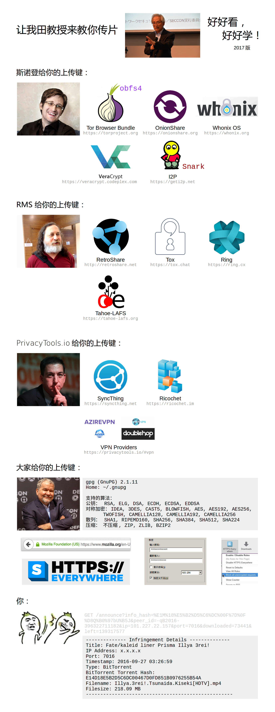

# Dr. Tanaka Says

Dear Fansubbers: Don't be stupid! Let me teach you how to stay safe on the Internet.

## 斯诺登给你的上传键：

Tor Browser Bundle: https://torproject.org    [GetTorBrowser](https://github.com/TheTorProject/gettorbrowser) [gettor@torproject.org](mailto:gettor@torproject.org) [@get_tor](https://twitter.com/get_tor)

OnionShare: https://onionshare.org    https://github.com/micahflee/onionshare

Whonix OS: https://whonix.org

VeraCrypt: https://veracrypt.codeplex.com

I2P and I2P Snark: https://geti2p.net

Purple I2P: https://github.com/PurpleI2P/i2pd

## RMS 给你的上传键：

RetroShare: http://retroshare.net    https://github.com/RetroShare

Tox: https://tox.chat    https://github.com/qTox/qTox

Ring: https://ring.cx

Tahoe-LAFS: https://tahoe-lafs.org

## [PrivacyTools.io](https://privacytools.io) 给你的上传键：

SyncThing: https://syncthing.net

Ricochet: https://ricochet.im    https://github.com/ricochet-im/ricochet

Recommended VPN Providers: https://privacytools.io/#vpn

## 大家给你的上传键：

GPG: `gpg --help`    https://www.gpg4win.org/

HTTPS Everywhere: https://www.eff.org/https-everywhere

7-Zip (use with Wine): http://7-zip.org

PeaZip: http://peazip.org

## Printable Version

[Your Upload Buttons.pdf](Your_Upload_Buttons.pdf)
